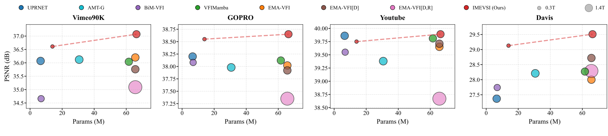

# IMEVSI: Online Adaptive Video Stream Interpolation via Inertia-Aware Motion Estimation


This is the official implementation of the paper: **"IMEVSI: Online Adaptive Video Stream Interpolation via Inertia-Aware Motion Estimation"**.

> **Abstract:** *Recent video frame interpolation (VFI) methods rely on computationally heavy modules (e.g., global attention module) to handle large motions, incurring prohibitive costs which hinders their practical real-time deployment. In this work, we revisit the core objective of VFI: enhancing the temporal resolution of videos. We identify that previous VFI’s frame-isolated processing ignores continuous temporal modeling, introduces computational redundancy in video streaming scenarios. To address this, we propose an online learning recurrent net with inertia-aware motion estimation(IMEVSI). It consists of implicit motion propagation(IMP), explicit motion propagation(EMP) and adaptive online learning strategy(AOL). IMP and EMP are used to high order inter-frame motion modeling considering motion inertia, AOL are proposed to bridge the motion domain gap between training and deployment. For IMP, we initiate from explicit physical motion modeling, progressively integrating learnable parameters into inertia-ware motion extraction and finally unify motion propagation and extraction within our recurrent motion propagation Transformer(RMPT). For EMP, we directly inject adjacent motion into current flow estimation recognizing its inertia contribution. For AOL,we leverage cycle consistency to dynamically adjust intermediate flow estimator and maintains an adaptive threshold to control parameter update. Extensive experiments demonstrate that our method outperforms state-of-the-art (SOTA) approaches on regular, large-motion, and high resolution benchmarks while achieving excellent inference speed and FLOPs.*


*Figure 1: performance and complexity of our method.*


*Figure 2: Overview of the proposed method.*

## 📢 News
* **2025-12-30**: Code and pre-trained models are released.

## :two_hearts:Dependencies
We provide our environment configuration as a reference:
- python == 3.8.17
- opencv-python == 4.8.0.76
- numpy == 1.24.4
- Pillow == 10.0.1
- torch == 1.12.0+cu116
- scikit-image == 0.21.0
- tqdm == 4.66.1
- torchvision == 0.13.0+cu116
- timm == 0.9.11

## :sparkles: Training

**Step 1: Prepare Dataset**
Download the Vimeo90K dataset (septuplets) from [here](http://toflow.csail.mit.edu/). Unzip and ensure the directory is organized as:

```text
vimeo90k
├── GT
│   ├── 00001
│   │   ├── 0001      # Contains im0.png, im2.png ... im6.png
│   │   └── ...
│   └── ...
├── sep_trainlist.txt
└── sep_testlist.txt
```

**Step 2: Run Training Script We provide a shell script for distributed training.**
'''bash
torchrun --nproc_per_node=4 --nnodes=1 --node_rank=0 pretrain.py --world_size 4 --batch_size 2 --data_path /path/to/Vimeo90K
## :runner:	Evaluation
1. Download the datasets you need:
* [Xiph dataset](https://github.com/sniklaus/softmax-splatting/blob/master/benchmark_xiph.py)
* [GOPRO and YouTube from SNU-FILM dataset](https://myungsub.github.io/CAIN/)
2. Download the [model checkpoints](https://pan.baidu.com/s/1WSYp43iJuywJlZksnYoklQ 
)(&code 9tsq) and put the ```ckpt``` folder into the root dir.
3. Run following command to evaluate:
Vimeo90K:
```shell
python benchmark/Vimeo_sequence.py
```
Xiph:
```shell
python benchmark/Xiph_sequence.py --path /path/to/Xiph_dataset --number 122/126/168
```
GOPRO, YouTube and Davis:
```shell
python benchmark/sequence_test.py --path /path/to/(GOPRO/YouTube/Davis) --number 122/126/168 --save_path ./results/
```
GOPRO, YouTube and Davis using online learning:
```shell
python benchmark/online_sequence_test.py --path /path/to/(GOPRO/YouTube/Davis) --number 122/126/168 --save_path ./results/
```
/path/to/(GOPRO/YouTube/Davis) should be organized as:
```text
/Your_Dataset_Path
├── scene_01
│   ├── 00001.png   <-- Input Frame (t)
│   ├── 00002.png   <-- Ground Truth (t+0.5)
│   ├── 00003.png   <-- Input Frame (t+1)
│   ├── 00004.png   <-- Ground Truth
│   ├── 00005.png   <-- Input Frame
│   └── ...
├── scene_02
│   ├── 0001.jpg
│   ├── 0002.jpg
│   └── ...
└── ...
```
## :heartpulse:	Acknowledgement
We borrow some codes from [EMA-VFI](https://github.com/MCG-NJU/EMA-VFI), We thank the authors for their great work.